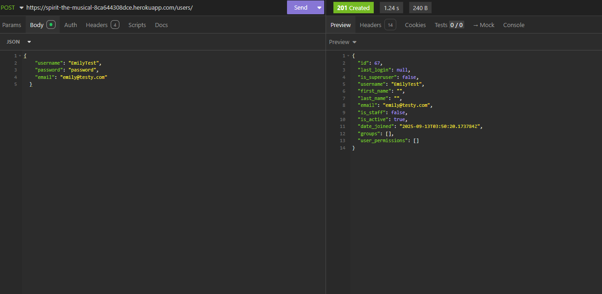
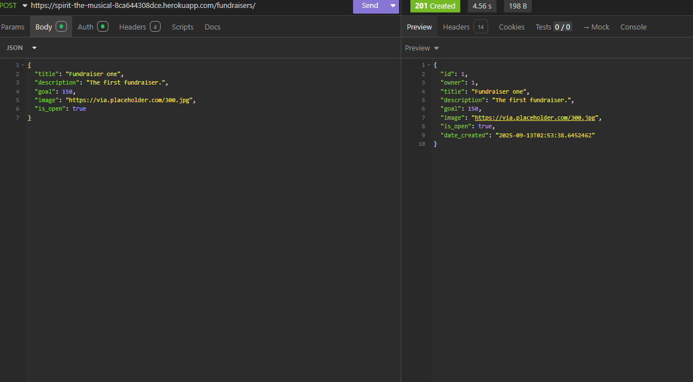
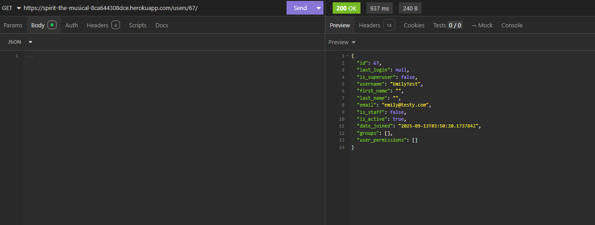
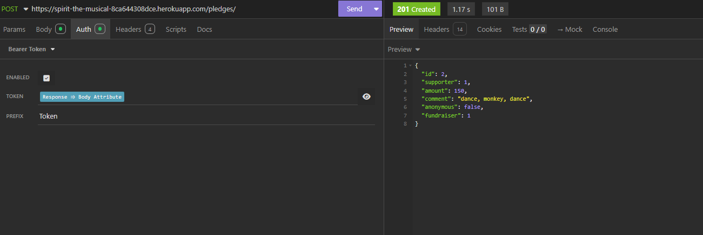
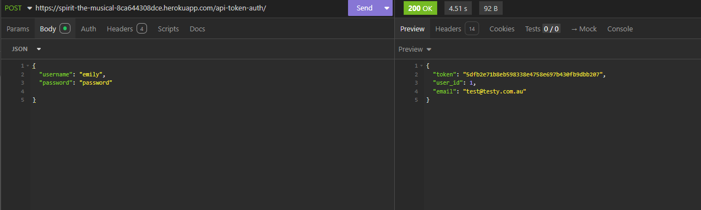

# Crowdfunding Back End
Emily Sheridan

## Planning:
### Concept/Name
**Performance Pets** is a fundraising platform to assist talented pets to develop and train for a future career in the performing arts.

### Intended Audience/User Stories
- Fundraiser owners: For people who believe their pet should have a career in the performing arts, such as acting on stage in a musical or on the big screen, and want to fundraise for their pet's acting/singing/dancing lessons. 
- Supporters: For people who are supporters of the arts and up-and-coming thespians, regardless of species. 

### Front End Pages/Functionality

#### Landing Page (Home Page)
- **Fundraiser platform summary** Brief overview about what this fundraising platform has been designed for and who can fundraise on it.
- **List of fundraisers** Featured open fundraisers ('featured' defn TBC but could be newest created, highest pledges, lowest pledges etc). Has text saying to click on the fundraiser name for more details.
- **Log In / Sign Up** On side of page, with user name and password elements and "Log In" CTA button. Clicking Log In will keep you on the landing page, but in the logged in state. Under the Log In CTA, there is text saying "Want to create your own fundraiser or make a pledge? Sign Up now", with words 'Sign Up' being linked to a new Sign Up page. 
- **Search** function

#### Sign Up Page
- **Create new user** Requires input of Name, Password and Email Address to create a user account. If successful, returns to the Landing Page in logged in status, otherwise error messages will come up to correct issues.

#### Create New Fundraiser Page
- **Form with fundraiser details** Requires input of Title, Description, Thumbnail image, $ Target, Creation Date, Open/Closed for pledges toggle, User name (fundraiser owner).
- **Submit button** to publish (make public).
- **Nice error pages** for validation of input ie. errors, missing fields etc.

#### Selected Fundraiser Page
- **Information about fundraiser** shown, as per create new fundraiser page
- **Pledges made so far** list, with supporter name, $ pledged and comments. Also has a graphical element showing total progress towards $ Target. 
- **Support this fundraiser** CTA, to make a pledge

### API Spec

| URL                  | HTTP Method | Purpose                         | Request Body | Success Response Code | Authentication/Authorisation |
| -------------------- | ----------- | ------------------------------- | ------------ | --------------------- | ---------------------------- |
| /fundraisers/        | GET         | Return all fundraisers (list)   | N/A          | 200                   | None                         |
| /fundraisers/        | POST        | Create new fundraiser           | JSON Payload | 201                   | Any logged in user           |
| /fundraisers/{pk}/   | GET         | Return one fundraiser (detail)  | N/A          | 200                   | None                         |
| /fundraisers/{pk}/   | PUT         | Update one fundraiser           | JSON Payload | 200                   | Logged in fundraiser owner   |
| /pledges/            | GET         | Return all pledges (list)       | N/A          | 200                   | None                         |
| /pledges/            | POST        | Create new pledge               | JSON Payload | 201                   | Any logged in user           |
| /pledges/{pk}/       | GET         | Return one pledge (detail)      | N/A          | 200                   | None                         |
| /pledges/{pk}/       | PUT         | Update one pledge               | JSON Payload | 200                   | Logged in pledge owner       |
| /users/              | GET         | Return all users (list)         | N/A          | 200                   | None                         |
| /users/              | POST        | Create new user                 | JSON Payload | 201                   | None                         |
| /users/              | PUT         | Update user account             | JSON Payload | 200                   | Logged in user account owner |
| /users/              | POST        | Authenticate user (token)       | JSON Payload | 200                   | None                         |
| /users/{pk}/         | GET         | Return one user account         | N/A          | 200                   | Any logged in user           |

### DB Schema

### Create New User (POST):

- **Endpoint** link: https://spirit-the-musical-8ca644308dce.herokuapp.com/users/

- **Body data**

### Create New Fundraiser (POST):

- **Endpoint** link: https://spirit-the-musical-8ca644308dce.herokuapp.com/fundraisers/

- **Body data**

### Successful GET method (Insomnia)

### Successful POST method (Insomnia)

### Token being returned (Insomnia)
